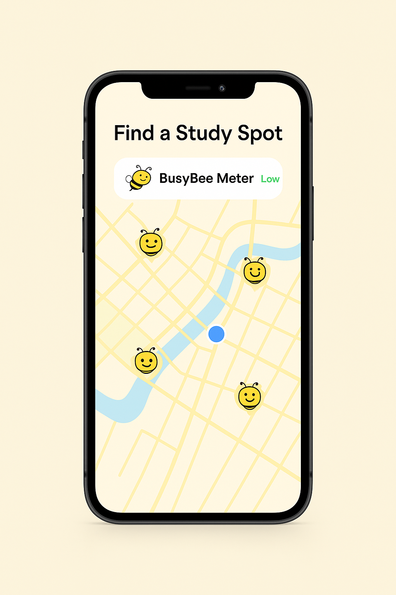

# 🐝 BusyBee – Smart Study Spot Finder

**BusyBee** is a front-end prototype of a location-based web application designed to help students find ideal study environments based on factors such as crowd levels, Wi-Fi availability, and quiet zones.

This project is a **conceptual mockup** — it demonstrates layout, design, and user interface features using static content and visuals. While it does not use live APIs or real-time location services, it represents the **vision** of a potential study-spot-finder app.

---

## 🔍 Features

- 🐝 Custom-designed interactive UI  
- 📍 Study spot filtering (e.g., Wi-Fi, quiet zones, power outlets)  
- 🟡 BusyBee Meter to show crowd levels (mock data)  
- 🗺️ Custom map interface with bee-themed location pins  
- 📱 Fully responsive layout for desktop and mobile  
- 💬 About and Contact sections with form  

---

## 📁 Tech Stack

- HTML5  
- CSS3  
- JavaScript (Vanilla JS)  
- LottieFiles animations  
- GitHub Pages (for deployment)  

---

## 🚀 Status

This website is a **mock business concept** developed for a class project. It is not connected to any backend or live map data. The goal was to showcase the idea through a cohesive visual and functional design.

---

## 📸 Preview

---

## 📎 Live Site (GitHub Pages)

👉 [Click here to visit the BusyBee mock site](https://kelechi-onwuka.github.io/BusyBee/index.html)

---

## 🧠 Inspiration

BusyBee was inspired by the real-world need for students to quickly locate good study spots with the right amenities. It imagines a user-first solution to an everyday campus challenge.

---

## 📌 Disclaimer

BusyBee is a class project and not affiliated with any real business, institution, or mapping platform.
